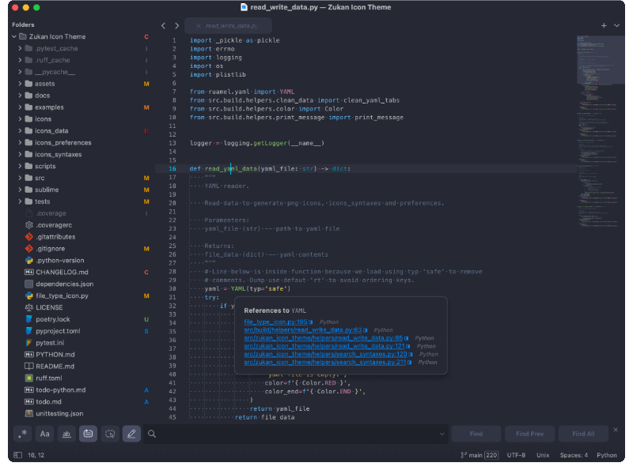
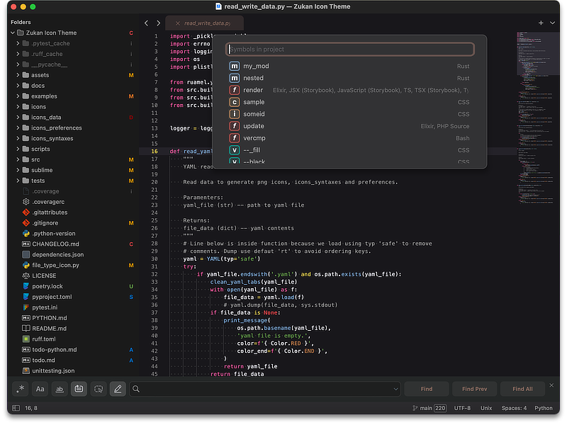
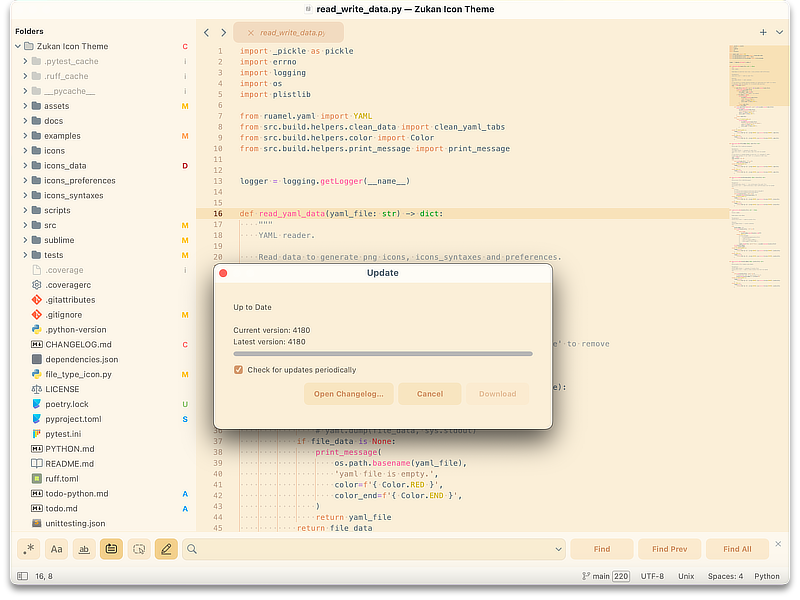
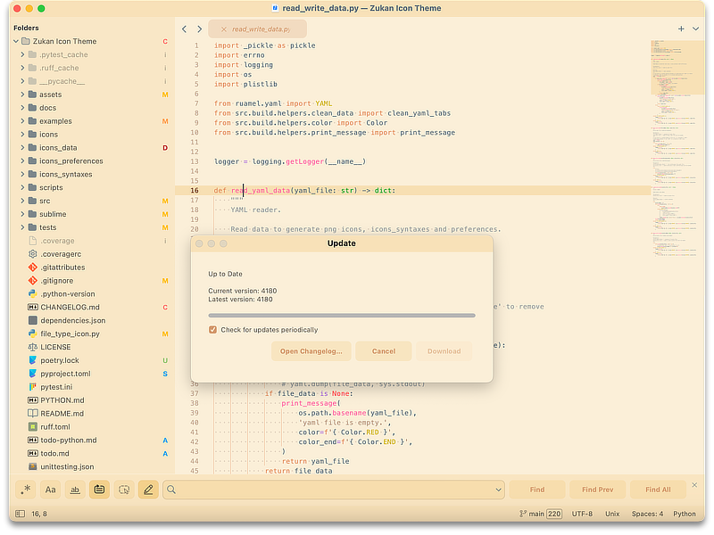

## Theme Treble

[](https://www.sublimetext.com/download)  

Treble theme has an adaptative, dark and light option (Click name to view)  

<details>
  <summary>Adaptive</summary>
  
</details>
<details>
  <summary>Dark</summary>
  
</details>
<details>
  <summary>Light</summary>
  
</details>

You can also choose from 3 theme style options, you do it in your user settings `Sublime Text > Preferences > Settings`

```
// Preferences.sublime-settings
// Options are "mix", "analog" or "digital".
"adaptive_theme_style": "digital",
"dark_theme_style: "analog",
"light_theme_style: "mix"
```

> Screenshots from v0.2.10  

> In screenshots, we are using Color Scheme Bass and Zukan Icon Theme  
[Color Scheme - Bass](https://github.com/53v3n3d4/Color-Scheme-Bass)  
[Zukan Icon Theme](https://github.com/53v3n3d4/Zukan-Icon-Theme)  

## Settings

> Grayscale - Kind container, Git status badges, Folder icons and Accent color


> Adaptive contrast light



> Adaptive contrast dark



For full theme settings and sublime text settings compatible, please take a look at the [`SETTINGS.md`](https://github.com/53v3n3d4/Theme-Treble/blob/main/SETTINGS.md) page.  

You can also see theme settings in [Preferences.sublime-settings](https://github.com/53v3n3d4/Theme-Treble/blob/main/Preferences.sublime-settings).

## Package installation

The recommended way to install is through [PackageControl.io](https://packagecontrol.io/packages/Theme%20-%20Treble).  
- Menu `Tools > Command Palette > Package Control: Install Package`  
- Type `Treble`, search for `Theme - Treble`  
- Click to install it  

To install manually, [download](https://github.com/53v3n3d4/Theme-Treble/releases) the latest release version zip file and uncompress it on your Sublime Text `Packages` folder.  
- Download the zip file on [`releases`](https://github.com/53v3n3d4/Theme-Treble/releases) page  
- Menu `Sublime Text > Preferences > Browse packages...` to open destination folder  
- Then unzip `Theme-Treble zip file` inside `Packages` folder  
- Rename folder `Theme-Treble` to `Theme - Treble`. This is important for textures images and Main.sublime-menu work  

> If you prefer clone this repo  
Mac/Linux `$ git clone https://github.com/53v3n3d4/Theme-Treble.git Theme\ -\ Treble`  
Windows `$ git clone https://github.com/53v3n3d4/Theme-Treble.git "Theme - Treble"`  

## Uninstall

To remove package using Package Control.  
- Menu `Tools > Command Palette > Package Control: Remove Package`  
- Click on `Theme - Treble`  

To uninstall manually, go to your Sublime Text folder.  
- Menu `Sublime Text > Preferences > Browse packages...`  
- Then delete `Theme - Treble` inside `Packages` folder  

## Memory/Cpu/Energy

You can check [Memory/Cpu/Energy tests page](https://github.com/53v3n3d4/Theme-Treble/blob/main/pkgtest/PKGTEST.md)  

## File icon :alien:

The file icons packages bellow was tested and work with this theme:  
- [A File Icon](https://github.com/SublimeText/AFileIcon)  
- [FileIcons](https://github.com/braver/FileIcons)  

> FileIcons need to create a theme file.

## Other themes and color schemes :dizzy:

- [D'Aneo](https://github.com/SublimeText/Theme-DAneo/)  
- [Brackets](https://github.com/jwortmann/brackets-theme)  
- [Ayu](https://github.com/dempfi/ayu)  
- [Github sublime theme](https://github.com/mauroreisvieira/github-sublime-theme)  
- [Two Dark](https://github.com/erremauro/TwoDark)  
- [Dracula](https://draculatheme.com/sublime)  

> We use some settings ideas from [D'Aneo](https://github.com/SublimeText/Theme-DAneo/).  

## License

MIT license ([LICENSE-MIT](LICENSE))
