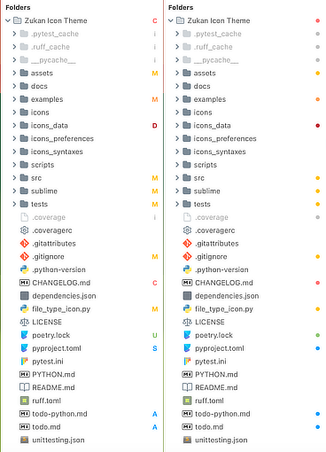
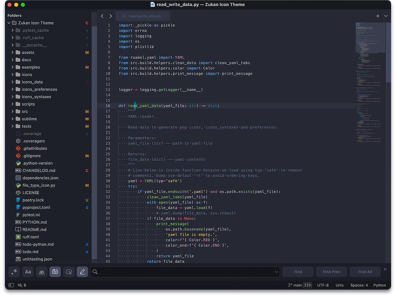

## Settings options

> Accent color


> Vcs status style - Letters or Circle



> Wide scroll bars



## Menu

- [Theme Settings](https://github.com/53v3n3d4/Theme-Treble/blob/main/SETTINGS.md#theme-settings)  
- [Sublime Text settings](https://github.com/53v3n3d4/Theme-Treble/blob/main/SETTINGS.md#sublime-text-settings)  

## Theme settings

Below are theme options available and can be customize at your option.  
- Go to menu `Sublime text > Preferences > Settings > Package Settings > Theme - Treble > Settings`. It is the same if you go to `Packages/User/Preferences.sublime-settings`  
- Copy the option you want on the right window of `Preferences.sublime-settings`  
- Save your preferences  

```
    // Treble Theme settings

    // Global

    // Theme style changes format of sidebar icons, tab buttons, 
    // scroll bars, quick panels, panel buttons.
    // Options are:
    // - mix
    // - analog
    // - digital
    //
    // Treble Dark Theme style options
    "dark_theme_style": "analog",

    // Treble Light Theme style options
    "light_theme_style": "mix",

    // Treble Adaptive Theme style options
    "adaptive_theme_style": "digital",

    // Accent color are used on several places, like: sidebar 
    // selected file/folder, tab buttons, selected or matched 
    // on quick panels and auto complete, panel buttons, 
    // indexing status progress bar, check for updates window.
    //
    // Colors options are:
    // - blue
    // - purple
    // - pink
    // - red
    // - orange
    // - yellow
    // - green
    // - grayscale
    // - color-scheme
    //
    // Dafault is color-scheme
    "accent_color": "color-scheme",

    // Display a wider scroll bar option.
    "wide_scroll_bars": false,

    // This option changes background color tone of title bar, 
    // sidebar, panels, status bar and maybe tab depends on 
    // tab style. It darks or lights based on Color-scheme 
    // background color. Adaptive theme only.
    "adaptive_contrast": false,

    // Control the tone of title bar, sidebar, panels, status 
    // bar and maybe tabset. Only works when adaptive_contrast
    // is true.
    //
    // It will dark or light the background color of the
    // components above.
    //
    // Valid options are:
    // - dark
    // - light
    //
    // Default is dark.
    "adaptive_contrast_tone": "dark",

    // Change opacity of theme text, icons and buttons.
    //
    // Valid options are:
    // - low
    // - medium
    // - high
    //
    // Default is high.
    "theme_opacity": "high",

    // Option to show icons on input panels and quick panels. 
    // Console, find/replace, goto file and command palette 
    // icons.
    "show_input_icon": true,

    // Option to show panel input textures.
    //
    // Default is true. Turn to false if you want to hide
    // them.
    "show_input_panel_textures": true,

    // Row padding space in sidebar, quick panels and auto
    // complete.
    //
    // Valid options are:
    // - normal
    // - large
    //
    // Default is normal.
    "row_padding_space": "normal",

    // Sidebar

    // Disclosure is the icon on the left of folder icon.
    // author: D'Aneo Theme 
    // https://github.com/SublimeText/Theme-DAneo/
    "show_disclosure_buttons": true,

    // Show or hide icons file types.
    // author: D'Aneo Theme 
    // https://github.com/SublimeText/Theme-DAneo/
    "show_sidebar_icons": true,

    // Folder icon colors accepted:
    // - blue
    // - yellow
    // - graphite
    // - adaptive
    //
    // Default is adaptive.
    "folder_icon_color": "adaptive",

    // Folder icon style can be:
    // - semiopaque
    // - solid
    // - outline
    //
    // Default is semiopaque.
    "folder_icon_style": "semiopaque",

    // Controls whether to show vcs status of untracked files 
    // and folders by the color of their labels in the sidebar.
    // author: D'Aneo Theme 
    // https://github.com/SublimeText/Theme-DAneo/
    "show_sidebar_untracked_label_colors": false,

    // Controls whether to show vcs status of tracked files 
    // and folders by the color of their labels in the sidebar.
    // author: D'Aneo Theme 
    // https://github.com/SublimeText/Theme-DAneo/
    "show_sidebar_tracked_label_colors": false,

    // Controls whether to show vcs status of ignored files 
    // and folders by the color of their labels in the sidebar.
    // author: D'Aneo Theme 
    // https://github.com/SublimeText/Theme-DAneo/
    "show_sidebar_ignored_label_colors": true,

    // Git status badge style on the right of sidebar 
    // files/folder labels.
    //
    // Options:
    // - letters
    // - circle
    //
    // Default is letters.
    "git_status_badge_style": "letters",

    // Git status badge color on the right of sidebar 
    // files/folder labels.
    //
    // Options:
    // - multicolor
    // - grayscale
    //
    // Default is multicolor.
    "git_status_badge_color": "multicolor",

    // Tabs

    // Tabs style options: do, re, mi and fa.
    //
    // Options descriptions:
    // - do: Only do style has tab button glued to sheet 
    // view. This option has support for inactive sheet 
    // dimming feature if tabset_background set to true 
    // (Dark and Light theme) or adaptive_contrast set to 
    // true (Adaptive theme).
    // A minimal layout can be achieved with option do and 
    // tabset_background/adaptive_constrast set to false. This
    // result in tab button showing only text separate by line
    // dividers.
    // - re: All buttons, selected or unselected, has a 
    // background color. Format of button will vary from theme 
    // style choosen (analog, mix or digital). Like do
    // option, tabset bar can have a background color or be 
    // transparent.
    // - mi: Selected tab button will be painted with 
    // accent_color. Tabset bar will always be transparent. 
    // And, like option do, unselected buttons are only text 
    // separated by line dividers.
    // - fa: Similar to mi, seleted tab button will be 
    // painted with accent_color. And tabset bar will be 
    // transparent. But unselected tab buttons will have a 
    // background color.
    //
    // Default is mi.
    "tab_style": "mi",

    // Show highlight color for added and deleted file.
    "show_add_delete_color": true,

    // Tab highlight modified style. Valid options are: 8vb and 
    // 8va.
    //
    // Options descriptions:
    // - 8vb: display a full width bar at bottom of tab 
    // - 8va: display a center width bar inside tab
    // button.
    //
    // This feature works only if sublime setting 
    // highlight_modified_tabs set to true.
    //
    // Default is 8va.
    "tab_modified_style": "8va",

    // Dark and Light theme option to display background for 
    // tabs style "do" and "re".
    "tabset_background": true,

    // Quick panels

    // Option to display or not, quick panels and auto complete 
    // panels shadow.
    "overlay_shadows": true,

    // Display kind containers in grayscale.
    "kind_container_grayscale": false,

    // Panels

    // Option to display or hide close button on panel.
    // author: D'Aneo Theme 
    // https://github.com/SublimeText/Theme-DAneo/
    "show_panel_close_button": true,

    // Option to make transparent background the buttons panels.
    "button_background_transparent": false,

    // Use accent color on panel icon buttons.
    "show_panel_icon_accent": false,

    // Option that group panel icon buttons. Like in ST3.
    "show_buttons_grouping": false,

    // Panel size buttons. All buttons on Find, Replace and 
    // Find in files panels.
    //
    // Valid options are:
    // - small
    // - medium
    // - large
    //
    // Default is medium.
    "panel_button_size": "medium",

    // Panel content width of Find, Replace, Find in files,
    // Console and Output.
    //
    // Valid values are:
    // - full
    // - center
    //
    // Default is full.
    "panel_content_width": "full"
```

## Sublime Text settings

The sublime settings below are some that are tested and work with this theme:  
* [x] adaptive_dividers, only on Adaptive Theme  
* [x] [always_show_minimap_viewport](https://www.sublimetext.com/docs/themes.html#always_show_minimap_viewport)  
* [x] [bold_folder_labels](https://www.sublimetext.com/docs/themes.html#bold_folder_labels)  
* [x] find_in_files_context_lines  
* [x] fold_style  
* [x] hide_new_tab_button  
* [x] hide_tab_scrolling_buttons  
* [x] [highlight_modified_tabs](https://www.sublimetext.com/docs/themes.html#highlight_modified_tabs)  
* [x] [inactive_sheet_dimming](https://www.sublimetext.com/docs/themes.html#inactive_sheet_dimming)  
* [x] kind_container  
* [x] minimap_horizontal_scrolling  
* [x] [overlay_scroll_bars](https://www.sublimetext.com/docs/themes.html#overlay_scroll_bars)  
* [x] popup_shadows  
* [x] ruler_style  
* [x] ruler_witdh  
* [x] show_encoding  
* [x] show_git_status  
* [x] show_git_status_in_status_bar  
* [x] show_indentation  
* [x] show_line_column  
* [x] show_line_endings  
* [x] show_sidebar_button  
* [x] show_syntax  
* [x] [show_tab_close_buttons](https://www.sublimetext.com/docs/themes.html#show_tab_close_buttons)  
* [x] show_tab_close_buttons_on_left  
* [x] sidebar_on_right  
* [x] ui_scale  
