This test is about checking the Memory/Cpu/Energy usage in Sublime Text 4 v4143 using Theme Treble.  

## Test

| Memory usage <br/>Macbook Pro 15 2014 16gb RAM   | Untitled | Big file | 1 Folder <br/>(6 big files) | 3 folder <br/>(4 files each) |
| ------------------------------------------------- | :------: | :------: | :-------------------------: | :--------------: |
| No packages, default                              | 40M      | 50M      | 58M       | 80M        |
| No packages, bass-treble                          | 47M+     | 63M      | 71M       | 90M        |
| Packages, default                                 | 43M      | 50M      | 58M+      | 98M        |
| Packages, bass-treble                             | 47M      | 57M+     | 69M       | 93M        |
| Packages, default, size 120 col with settings     | 41M      | 58M+     | 70M       | 108M       |
| Packages, bass-treble, size 120 col with settings | 47M      | 65M+     | 86M       | 120M       |
| Fullhd, packages, bass-treble, max size <br />with settings | 49M | 68M | 78M       | 93M+       |

From the tests done, we notice that Bass-Treble combo (Treble Dark/ Biohack / file-type-icons) uses more memory than default (Dark/Mariana), and the memory usage difference was between 7-16M on Macbook 15 2014 and 7-15M on Macbook 14 2021. It seems that theme engine is supporting themes with lot of settings/options.  

Apple M1 Pro chips on tests use significant more memory than old intel iCore i7. This is not related to sublime, there are reports about macbooks with M1 chips using more memory then with intel chips.  

Also worth mention, that we observed situtations that can lead to increase or decrease memory usage. In tests we tried to get best memory usage on any case. But only thing we done was activate window clicking on sublime button in dock.  

We have run these test a few times, mostly because it happened that results are very different from each other. And after getting better results of samples that are supposed to use more memory, we run it again to check if is right. Example, sample `1 Folder (6 big files)` with less memory usage than `Big file`.  

Fullhd test show better memory usage and it was done on another day after other tests. So we did not start over from beginning again as we wrote above about differences in samples results. Also, I can not do a 4k monitor test.  

Sublime, in these tests, could return to 0% cpu usage after few seconds and to state sleeping very fast after we go to Activity Monitor or terminal.  

| Memory usage <br/>Macbook Pro 14 2021 16gb RAM   | Untitled | Big file | 1 Folder <br/>(6 big files) | 3 folder <br/>(4 files each) |
| ------------------------------------------------- | :------: | :------: | :-------------------------: | :--------------: |
| Packages, default, size 120 col with settings     | 101M     | 126M     | 145M      | 216M       |
| Packages, bass-treble, size 120 col with settings | 110M+    | 133M     | 154M      | 231M       |

Below are screenchots of Activity Monitor after the tests above, where we can see that was no spike on memory, cpu or energy (click to open).

<details>
  <summary>Packages, default, size 120 col with settings - Macbook 14 2021</summary>
  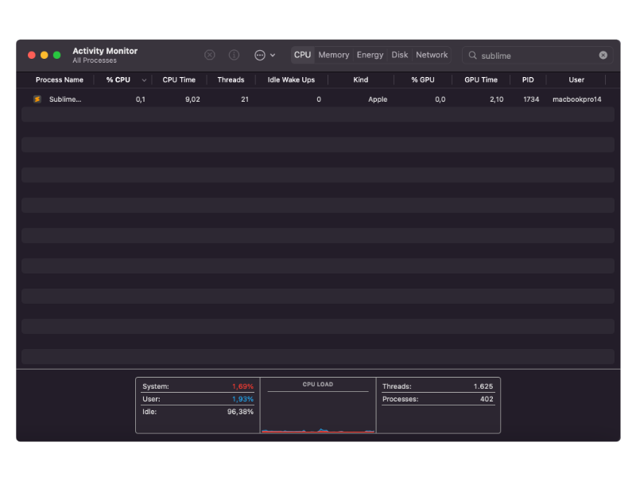
  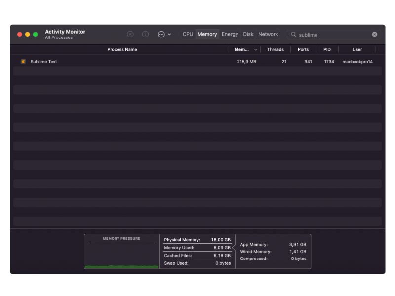
  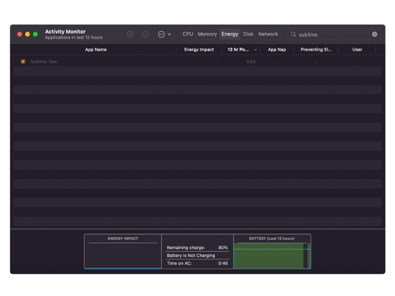
</details>
<details>
  <summary>Packages, bass-treble, size 120 col with settings - Macbook 14 2021</summary>
  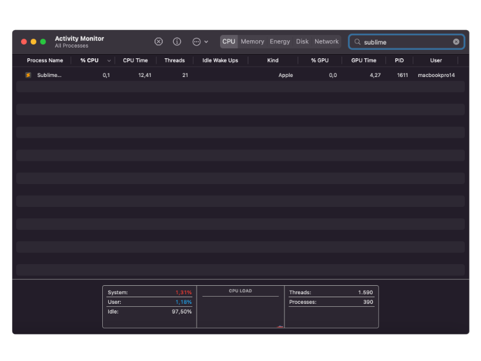
  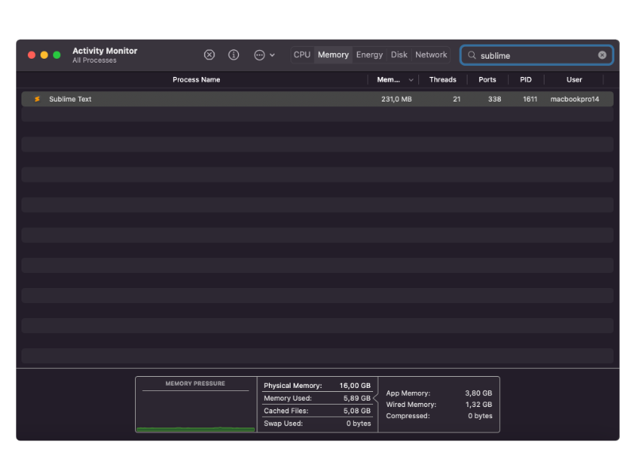
  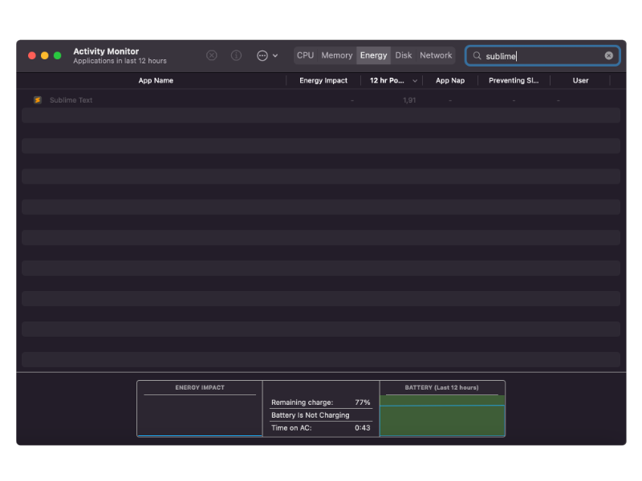
</details>
<details>
  <summary>Fullhd, Packages, default, max size with settings - Macbook 15 2014</summary>
  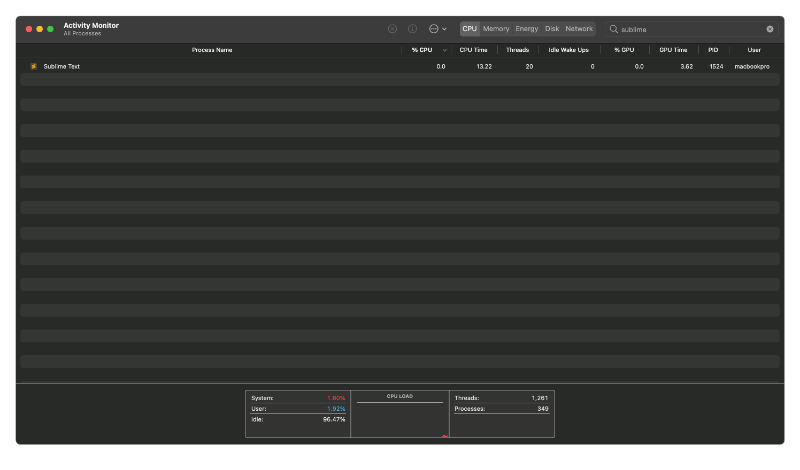
  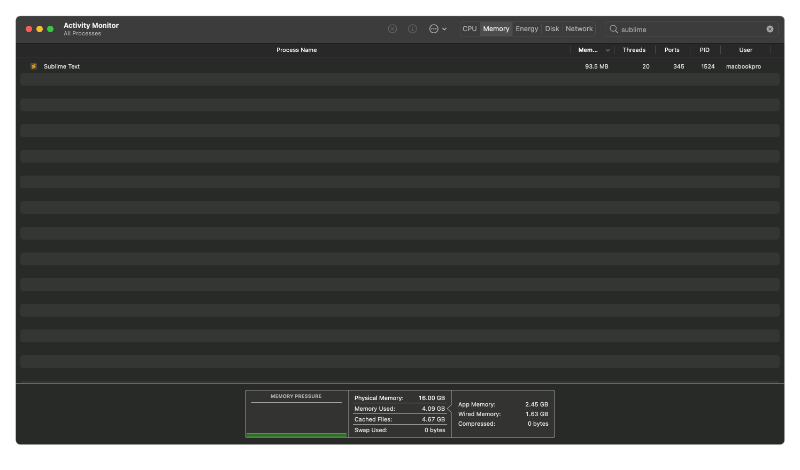
  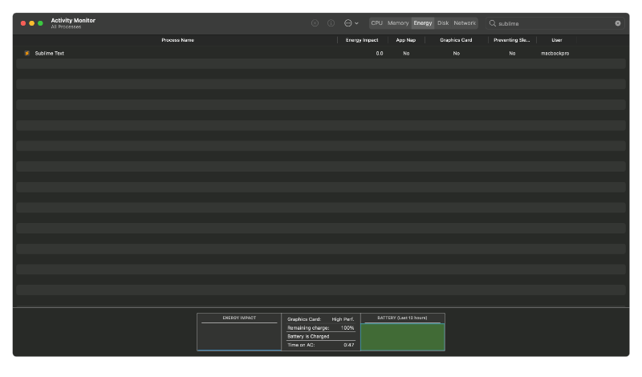
</details>

And here are Activity Monitor screenshots after inserting Macbook 15 samples results on this file, which consisted in open 24 txt files and put/edit in markdown tables.  

<details>
  <summary>Activity Monitor screenshots, editing this md file</summary>
  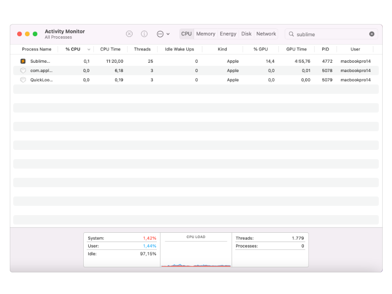
  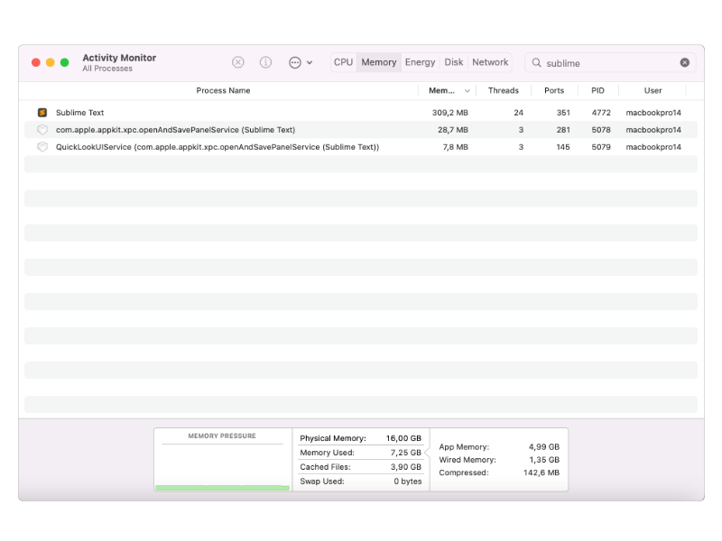
  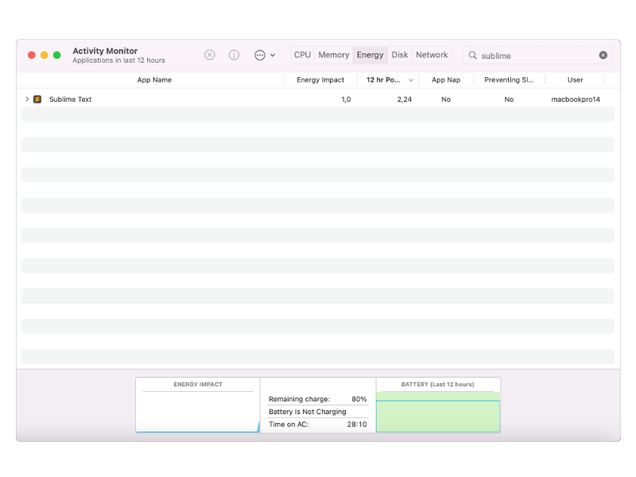
</details>

It was a 20+ minutes using sublime with bass-treble, settings, windows size 120 col and packages. Two sublime folders were open, also Safari browser and Terminal (iTerm2).  

## Samples

We used command `top` and Activity Monitor (macOS utility) to record samples. The command below was used for all tests to record 5 samples with 5 seconds interval.

```
$ top -l 5 -o cpu -R -F -s 5 ><FOLDER>/pkgtest/packages-settings-folders.txt -pid <PID NUMBER>
```

Seven situations was monitored: no packages/default theme, no packages/bass-treble, packages/default theme and packages/bass-treble, window size to 120 col packages/default/settings and window size to 120 col packages/bass-treble/settings.  

Before test, ST was reverted to a freshly installed state as describe on [Sublime Text docs](https://www.sublimetext.com/docs/revert.html).

Observations:
- 1st iterations with no packages/default was discarted because it shows performance numbers worst than with bass-treble. It could be indexing or another factor
- Each situation was done in this order: 1 untitled file open, 1 big file, 1 folder with 6 big files, 3 folders with 4 files each open [[1]](https://github.com/53v3n3d4/Theme-Treble/blob/main/pkgtest/PKGTEST.md#notes) using the same pid
- Files was opened only then go to Activity Monitor/Terminal. We observed a couple situations where after an action it could lead to decrease memory or increasy memory
- Activity Monitor, Terminal and Sublime Text was the only applications opened during test
- We wait for the memory usage return to minimum after open spike before record
- Out of 5 samples, we present in table below the one that used higher memory. The original files are in folders, [macbook-14-2021](https://github.com/53v3n3d4/Theme-Treble/tree/main/pkgtest/macbook-14-2021) and [macbook-15-2014](https://github.com/53v3n3d4/Theme-Treble/tree/main/pkgtest/macbook-15-2014)
- Windows size used are the default, the small one that opens when sublime open first time
- Windows size 120 col width + sidebar was tested 
- Tests was done in this order: No packages default, No packages bass-treble, Packages default, Packages bass-treble, Packages default with settings and windows size 120 col, Packages bass-treble with settings and windows size 120 col and 2x Fullhd, packages bass-treble with settings and max window size

Situations that we observe changes in memory usage:
- Open project/files and close sublime after a few minutes, reopen can lead to a decrease in memory usage
- Tab hover and go to Activity Monitor, could lead to a decrease
- Click on file can decrease memory usage
- Close folder/file can lead to rise in memory usage
- Close file, then open empty file, memory usage is bigger than if open empty file after start sublime

## Results

- [No packages, default, color scheme Mariana, theme Dark](https://github.com/53v3n3d4/Theme-Treble/blob/main/pkgtest/PKGTEST.md#no-packages-default-color-scheme-mariana-theme-dark)
- [No packages, bass-treble, color scheme Biohack, theme Treble Dark](https://github.com/53v3n3d4/Theme-Treble/blob/main/pkgtest/PKGTEST.md#no-packages-bass-treble-color-scheme-biohack-theme-treble-dark)
- [Packages, default, color scheme Mariana, theme Dark](https://github.com/53v3n3d4/Theme-Treble/blob/main/pkgtest/PKGTEST.md#packages-default-color-scheme-mariana-theme-dark)
- [Packages, bass-treble, color scheme Biohack, theme Treble Dark](https://github.com/53v3n3d4/Theme-Treble/blob/main/pkgtest/PKGTEST.md#packages-bass-treble-color-scheme-biohack-theme-treble-dark)
- [Packages, default, color scheme Mariana, theme Dark, window size 120 col + sidebar with settings](https://github.com/53v3n3d4/Theme-Treble/blob/main/pkgtest/PKGTEST.md#packages-default-color-scheme-mariana-theme-dark-window-size-120-col--sidebar-with-settings)
- [Packages, bass-treble, color scheme Biohack, theme Treble Dark, window size 120 col + sidebar with settings](https://github.com/53v3n3d4/Theme-Treble/blob/main/pkgtest/PKGTEST.md#packages-bass-treble-color-scheme-biohack-theme-treble-dark-window-size-120-col--sidebar-with-settings)
- [2x Fullhd, packages, bass-treble, color scheme Biohack, theme Treble Dark, max window size with settings](https://github.com/53v3n3d4/Theme-Treble/blob/main/pkgtest/PKGTEST.md#2x-fullhd-packages-bass-treble-color-scheme-biohack-theme-treble-dark-max-window-size-with-settings)

Computer

| Macbook Pro 14 2021 16gb RAM | Macbook Pro 15 2014 16gb RAM |
| ---------------------------- | ---------------------------- |
| macOS 12.6                   | macOS 11.2.8                 |
| ST4 v4143                    | ST4 v4143                    |


Packages installed

| ST Packages         |
| ------------------- |
| Babel               |
| Package Control     |
| Rust Enhanced       |
| SideBarEnhancements |
| TOML                |


> Bass-Treble means that Theme Treble, Color scheme Bass and file-type-icons are installed.
Settings, if not mentioned, are the [default](https://github.com/53v3n3d4/Theme-Treble/blob/main/Preferences.sublime-settings)

Files used in test [[1]](https://github.com/53v3n3d4/Theme-Treble/blob/main/pkgtest/PKGTEST.md#notes)
- empty file: one empty file, new untitled file
- big file: one big file, over 10k lines and 606kb
- 1 folder, 6 big files. Over 10k lines each
- 3 folders, each with 4 files open. 4 big files, 4 normal files, 4 small files

> All tests below, unless described, was done on Macbook 15 2014.

### No packages, default, color scheme Mariana, theme Dark

| TEST | PID | COMMAND | %CPU | TIME | #TH | #WQ | #PORTS | MEM | PURG | CMPRS | PGRP | PPID | STATE | BOOSTS | %CPU_ME | %CPU_OTHRS | UID | FAULTS | COW | MSGSENT | MSGRECV | SYSBSD | SYSMACH | CSW | PAGEINS | IDLEW | POWER | INSTRS | CYCLES | USER | #MREGS | RPRVT | VPRVT | VSIZE | KPRVT | KSHRD |
| -- | -- | -- | -- | -- | -- | -- | -- | -- | -- | -- | -- | -- | -- | -- | -- | -- | -- | -- | -- | -- | -- | -- | -- | -- | -- | -- | -- | -- | -- | -- | -- | -- | -- | -- | -- | -- |
| Untitled | 14539 | sublime_text | 0.0 | 00:00.56 | 19 | 1 | 273 | 40M | 48K | 0B | 14539 | 1 | sleeping | 0[8] | 0.00000 | 0.00000 | 501 | 23967 | 462 | 3838 | 851 | 22001 | 13422 | 4226 | 4 | 107 | 0.0 | 0 | 0 | macbookpro | N/A | N/A | N/A | N/A | N/A | N/A |
| Big file | 14539 | sublime_text | 0.0 | 00:01.76 | 20 | 1 | 309 | 50M | 624K | 0B | 14539 | 1 | sleeping | 0[19] | 0.00000 | 0.00000 | 501 | 61098 | 544 | 13254 | 2820 | 36587 | 36629+ | 10667+ | 4 | 414+ | 0.0 | 33360 | 160830 | macbookpro | N/A | N/A | N/A | N/A | N/A | N/A |
| 1 Folder (6 big files) | 14539 | sublime_text | 0.0 | 00:04.40 | 20 | 1 | 316 | 58M | 428K | 0B | 14539 | 1 | sleeping | 0[34] | 0.00000 | 0.00000 | 501 | 119564 | 570 | 31443 | 7336 | 67807 | 85449 | 22272 | 4 | 1099 | 0.0 | 0 | 0 | macbookpro | N/A | N/A | N/A | N/A | N/A | N/A |
| 3 folder (4 files each) | 14539 | sublime_text | 0.0 | 00:07.91 | 20 | 1 | 346 | 80M | 508K | 0B | 14539 | 1 | sleeping | *0[61] | 0.00000 | 0.00000 | 501 | 232751 | 646 | 61253 | 13631 | 102576+ | 158791 | 38404+ | 4 | 1894+ | 0.0 | 28404 | 92905 | macbookpro | N/A | N/A | N/A | N/A | N/A | N/A |


### No packages, bass-treble, color scheme Biohack, theme Treble Dark

| TEST | PID | COMMAND | %CPU | TIME | #TH | #WQ | #PORTS | MEM | PURG | CMPRS | PGRP | PPID | STATE | BOOSTS | %CPU_ME | %CPU_OTHRS | UID | FAULTS | COW | MSGSENT | MSGRECV | SYSBSD | SYSMACH | CSW | PAGEINS | IDLEW | POWER | INSTRS | CYCLES | USER | #MREGS | RPRVT | VPRVT | VSIZE | KPRVT | KSHRD |
| -- | -- | -- | -- | -- | -- | -- | -- | -- | -- | -- | -- | -- | -- | -- | -- | -- | -- | -- | -- | -- | -- | -- | -- | -- | -- | -- | -- | -- | -- | -- | -- | -- | -- | -- | -- | -- |
| Untitled | 13679 | sublime_text | 0.0 | 00:00.66 | 20 | 2 | 273- | 47M+ | 48K | 0B | 13679 | 1 | sleeping | *0[9] | 0.00000 | 0.00000 | 501 | 26420+ | 462 | 4472 | 1051 | 26657+ | 17310+ | 4843+ | 4 | 139+ | 0.0 | 253044 | 686242 | macbookpro | N/A | N/A | N/A | N/A | N/A | N/A |
| Big file | 13679 | sublime_text | 0.0 | 00:03.00 | 20 | 1 | 309 | 63M | 652K | 0B | 13679 | 1 | sleeping | *0[21] | 0.00000 | 0.00000 | 501 | 80834 | 550 | 20436 | 5218 | 48576 | 58633 | 15158 | 4 | 725 | 0.0 | 0 | 0 | macbookpro | N/A | N/A | N/A | N/A | N/A | N/A |
| 1 Folder (6 big files) | 13679 | sublime_text | 0.0 | 00:06.55 | 20 | 1 | 317 | 71M | 444K | 0B | 13679 | 1 | sleeping | 0[35] | 0.00000 | 0.00000 | 501 | 147863 | 579 | 40285 | 10878 | 85186+ | 112248 | 26537+ | 4 | 1445+ | 0.0 | 29921 | 94630 | macbookpro | N/A | N/A | N/A | N/A | N/A | N/A |
| 3 folder (4 files each) | 13679 | sublime_text | 0.0 | 00:12.66 | 20 | 1 | 347 | 90M | 524K | 0B | 13679 | 1 | sleeping | 0[82] | 0.00000 | 0.00000 | 501 | 262621 | 653 | 93268 | 22645 | 137847 | 241391 | 52994 | 4 | 3275 | 0.0 | 0 | 0 | macbookpro | N/A | N/A | N/A | N/A | N/A | N/A |


### Packages, default, color scheme Mariana, theme Dark

| TEST | PID | COMMAND | %CPU | TIME | #TH | #WQ | #PORTS | MEM | PURG | CMPRS | PGRP | PPID | STATE | BOOSTS | %CPU_ME | %CPU_OTHRS | UID | FAULTS | COW | MSGSENT | MSGRECV | SYSBSD | SYSMACH | CSW | PAGEINS | IDLEW | POWER | INSTRS | CYCLES | USER | #MREGS | RPRVT | VPRVT | VSIZE | KPRVT | KSHRD |
| -- | -- | -- | -- | -- | -- | -- | -- | -- | -- | -- | -- | -- | -- | -- | -- | -- | -- | -- | -- | -- | -- | -- | -- | -- | -- | -- | -- | -- | -- | -- | -- | -- | -- | -- | -- | -- |
| Untitled | 13982 | sublime_text | 0.0 | 00:00.79 | 19 | 1 | 273 | 43M | 48K | 0B | 13982 | 1 | sleeping | 0[13] | 0.00000 | 0.00000 | 501 | 26082 | 462 | 6314 | 1308 | 28830 | 19723 | 6284 | 4 | 170 | 0.0 | 0 | 0 | macbookpro | N/A | N/A | N/A | N/A | N/A | N/A |
| Big file | 13982 | sublime_text | 0.0 | 00:01.94 | 20 | 1 | 309 | 50M | 596K | 0B | 13982 | 1 | sleeping | *0[22] | 0.00000 | 0.00000 | 501 | 67975 | 546 | 14597 | 3073 | 43394 | 40393 | 11795 | 4 | 456 | 0.0 | 0 | 0 | macbookpro | N/A | N/A | N/A | N/A | N/A | N/A |
| 1 Folder (6 big files) | 13982 | sublime_text | 0.0 | 00:05.20 | 21 | 1 | 317+ | 58M+ | 428K | 0B | 13982 | 1 | sleeping | *0[37] | 0.00000 | 0.00000 | 501 | 142378+ | 593 | 42193 | 8844 | 78955+ | 104601 | 26229+ | 4 | 1141+ | 0.0 | 44589 | 168586 | macbookpro | N/A | N/A | N/A | N/A | N/A | N/A |
| 3 folder (4 files each) | 13982 | sublime_text | 0.0 | 00:08.66 | 21 | 1 | 347 | 98M | 508K | 0B | 13982 | 1 | sleeping | 0[58] | 0.00000 | 0.00000 | 501 | 260760 | 647 | 68799 | 14769 | 116131+ | 172259 | 40578+ | 4 | 2101+ | 0.0 | 28849 | 89349 | macbookpro | N/A | N/A | N/A | N/A | N/A | N/A |


### Packages, bass-treble, color scheme Biohack, theme Treble Dark

| TEST | PID | COMMAND | %CPU | TIME | #TH | #WQ | #PORTS | MEM | PURG | CMPRS | PGRP | PPID | STATE | BOOSTS | %CPU_ME | %CPU_OTHRS | UID | FAULTS | COW | MSGSENT | MSGRECV | SYSBSD | SYSMACH | CSW | PAGEINS | IDLEW | POWER | INSTRS | CYCLES | USER | #MREGS | RPRVT | VPRVT | VSIZE | KPRVT | KSHRD |
| -- | -- | -- | -- | -- | -- | -- | -- | -- | -- | -- | -- | -- | -- | -- | -- | -- | -- | -- | -- | -- | -- | -- | -- | -- | -- | -- | -- | -- | -- | -- | -- | -- | -- | -- | -- | -- |
| Untitled | 14317 | sublime_text | 0.0 | 00:00.65 | 20 | 2 | 275 | 47M | 48K | 0B | 14317 | 1 | sleeping | 0[8] | 0.00000 | 0.00000 | 501 | 26471 | 462 | 4123 | 1024 | 28034 | 16565+ | 4520+ | 4 | 86+ | 0.0 | 38040 | 160170 | macbookpro | N/A | N/A | N/A | N/A | N/A | N/A |
| Big file | 14317 | sublime_text | 0.0 | 00:01.89 | 20 | 1 | 309+ | 57M+ | 624K | 0B | 14317 | 1 | sleeping | *0[15] | 0.00000 | 0.00000 | 501 | 62940+ | 544 | 13913 | 3256 | 43498+ | 40622 | 10732+ | 4 | 367+ | 0.0 | 44691 | 163020 | macbookpro | N/A | N/A | N/A | N/A | N/A | N/A |
| 1 Folder (6 big files) | 14317 | sublime_text | 0.0 | 00:06.65 | 20 | 1 | 317 | 69M | 624K | 0B | 14317 | 1 | sleeping | 0[29] | 0.00000 | 0.00000 | 501 | 143496 | 594 | 48313 | 11498 | 89456 | 123371 | 28320 | 4 | 1316 | 0.0 | 0 | 0 | macbookpro | N/A | N/A | N/A | N/A | N/A | N/A |
| 3 folder (4 files each) | 14317 | sublime_text | 0.0 | 00:11.59 | 20 | 1 | 347 | 93M | 652K | 0B | 14317 | 1 | sleeping | 0[54+] | 0.00000 | 0.00300 | 501 | 242840+ | 658 | 89026+ | 21490+ | 137056+ | 226069+ | 48961+ | 4 | 2619+ | 0.0 | 227384 | 752255 | macbookpro | N/A | N/A | N/A | N/A | N/A | N/A |


### Packages, default, color scheme Mariana, theme Dark, window size 120 col + sidebar with settings

Settings Macbook 14 2021
```
	"always_show_minimap_viewport": true,
	"bold_folder_labels": false,
	"draw_white_space": "all",
	"font_size": 11,
	"highlight_line": true,
	"highlight_modified_tabs": true,
	"ignored_packages":
	[
		"Rust",
		"Vintage",
	],
	"indent_guide_options": ["draw_normal", "draw_active"],
	"line_padding_bottom": 1,
	"line_padding_top": 1,
	"show_encoding": true,
	"show_line_column": "compact",
	"show_line_endings": true,
	"show_tab_close_buttons_on_left": true,

``` 

Samples Macbook 14 2021

| TEST | PID | COMMAND | %CPU | TIME | #TH | #WQ | #PORTS | MEM | PURG | CMPRS | PGRP | PPID | STATE | BOOSTS | %CPU_ME | %CPU_OTHRS | UID | FAULTS | COW | MSGSENT | MSGRECV | SYSBSD | SYSMACH | CSW | PAGEINS | IDLEW | POWER | INSTRS | CYCLES | USER | #MREGS | RPRVT | VPRVT | VSIZE | KPRVT | KSHRD |
| -- | -- | -- | -- | -- | -- | -- | -- | -- | -- | -- | -- | -- | -- | -- | -- | -- | -- | -- | -- | -- | -- | -- | -- | -- | -- | -- | -- | -- | -- | -- | -- | -- | -- | -- | -- | -- |
| Untitled | 1734 | sublime_text | 0.0 | 00:00.47 | 19 | 1 | 277 | 101M | 464K | 0B | 1734 | 1 | sleeping | 0[8] | 0.00000 | 0.00000 | 501 | 7745 | 204 | 3461 | 2686+ | 27142+ | 16874+ | 4881+ | 1 | 61 | 0.0 | 1229588 | 1615812 | macbookpro14 | N/A | N/A | N/A | N/A | N/A | N/A |
| Big file | 1734 | sublime_text | 0.0 | 00:01.77 | 22 | 3 | 303 | 126M | 864K | 0B | 1734 | 1 | sleeping | 0[16] | 0.00000 | 0.00000 | 501 | 15265 | 254 | 12543 | 10116+ | 50948+ | 47422+ | 16798+ | 1 | 323 | 0.0 | 2077458 | 2648708 | macbookpro14 | N/A | N/A | N/A | N/A | N/A | N/A |
| 1 Folder (6 big files) | 1734 | sublime_text | 0.0 | 00:04.64 | 21 | 2 | 310 | 145M | 1200K | 0B | 1734 | 1 | sleeping | 0[24] | 0.00000 | 0.00000 | 501 | 23722 | 289 | 34822 | 28872+ | 81303+ | 103336+ | 42319+ | 1 | 867 | 0.0 | 1518994 | 2094771 | macbookpro14 | N/A | N/A | N/A | N/A | N/A | N/A |
| 3 folder (4 files each) | 1734 | sublime_text | 0.0 | 00:09.00 | 21 | 2 | 341 | 216M | 1328K | 0B | 1734 | 1 | sleeping | 0[38] | 0.00000 | 0.00000 | 501 | 39768 | 444 | 69425 | 56229+ | 122332+ | 191717+ | 83475+ | 3223 | 1601 | 0.0 | 1718794 | 2112434 | macbookpro14 | N/A | N/A | N/A | N/A | N/A | N/A |

Settings Macbook 15 2014
```
	"bold_folder_labels": false,
	"font_size": 11,
	"highlight_line": true,
	"highlight_modified_tabs": true,
	"ignored_packages":
	[
		"Rust",
		"Vintage",
	],
	"indent_guide_options": ["draw_normal", "draw_active"],
	"line_padding_bottom": 1,
	"line_padding_top": 1,
	"show_tab_close_buttons_on_left": true,
```


Samples Macbook 15 2014  
Here we use the 70M sample for 1 Folder (6 big files) because there was only one sample that had 86M, the other 4 samples was all 70M.  

| TEST | PID | COMMAND | %CPU | TIME | #TH | #WQ | #PORTS | MEM | PURG | CMPRS | PGRP | PPID | STATE | BOOSTS | %CPU_ME | %CPU_OTHRS | UID | FAULTS | COW | MSGSENT | MSGRECV | SYSBSD | SYSMACH | CSW | PAGEINS | IDLEW | POWER | INSTRS | CYCLES | USER | #MREGS | RPRVT | VPRVT | VSIZE | KPRVT | KSHRD |
| -- | -- | -- | -- | -- | -- | -- | -- | -- | -- | -- | -- | -- | -- | -- | -- | -- | -- | -- | -- | -- | -- | -- | -- | -- | -- | -- | -- | -- | -- | -- | -- | -- | -- | -- | -- | -- |
| Untitled | 15807 | sublime_text | 0.0 | 00:00.54 | 20 | 2 | 275 | 41M | 48K | 0B | 15807 | 1 | sleeping | *0[7] | 0.00000 | 0.00000 | 501 | 24468 | 462 | 3537 | 783 | 23542+ | 12883 | 4051+ | 4 | 63+ | 0.0 | 69582 | 239545 | macbookpro | N/A | N/A | N/A | N/A | N/A | N/A |
| Big file | 15807 | sublime_text | 0.0 | 00:01.91 | 20 | 1 | 309 | 58M | 624K | 0B | 15807 | 1 | sleeping | 0[25] | 0.00000 | 0.00000 | 501 | 62029 | 542 | 12661 | 2961 | 41778+ | 36516 | 10117+ | 4 | 469+ | 0.0 | 33243 | 130925 | macbookpro | N/A | N/A | N/A | N/A | N/A | N/A |
| 1 Folder (6 big files) | 15807 | sublime_text | 0.0 | 00:05.47 | 20 | 1 | 316 | 70M | 428K | 0B | 15807 | 1 | sleeping | *0[57] | 0.00000 | 0.00000 | 501 | 121200 | 566 | 39162 | 9568 | 77859 | 110350 | 26709 | 4 | 1577 | 0.0 | 0 | 0 | macbookpro | N/A | N/A | N/A | N/A | N/A | N/A |
| 3 folder (4 files each) | 15807 | sublime_text | 0.0 | 00:08.79 | 20 | 1 | 346 | 108M | 508K | 0B | 15807 | 1 | sleeping | 0[76] | 0.00000 | 0.00000 | 501 | 232268 | 616 | 61788 | 15265 | 110147 | 171234 | 38970 | 4 | 2317 | 0.0 | 0 | 0 | macbookpro | N/A | N/A | N/A | N/A | N/A | N/A |


### Packages, bass-treble, color scheme Biohack, theme Treble Dark, window size 120 col + sidebar with settings

Settings Macbook 14 2021  
Here we did a run 3 because first run was double than default on folders. So we did a run 2 and when putting tests together results was better than default. So a run 3 was done
```
	"always_show_minimap_viewport": true,
	"bold_folder_labels": false,
	"draw_white_space": "all",
	"font_size": 11,
	"highlight_line": true,
	"highlight_modified_tabs": true,
	"indent_guide_options": ["draw_normal", "draw_active"],
	"ignored_packages":
	[
		"Rust",
		"Vintage",
	],
	"line_padding_bottom": 1,
	"line_padding_top": 1,
	"show_encoding": true,
	"show_line_column": "compact",
	"show_line_endings": true,
	"show_tab_close_buttons_on_left": true,

	// Theme Treble
	"dark_theme_style": "digital",
	"light_theme_style": "digital",
	"adaptive_theme_style": "digital",
	"accent_color": "green",
	"adaptive_contrast": true,
	"tab_style": "do",
	"show_panel_icon_accent": true,
```

| TEST | PID | COMMAND | %CPU | TIME | #TH | #WQ | #PORTS | MEM | PURG | CMPRS | PGRP | PPID | STATE | BOOSTS | %CPU_ME | %CPU_OTHRS | UID | FAULTS | COW | MSGSENT | MSGRECV | SYSBSD | SYSMACH | CSW | PAGEINS | IDLEW | POWER | INSTRS | CYCLES | USER | #MREGS | RPRVT | VPRVT | VSIZE | KPRVT | KSHRD |
| -- | -- | -- | -- | -- | -- | -- | -- | -- | -- | -- | -- | -- | -- | -- | -- | -- | -- | -- | -- | -- | -- | -- | -- | -- | -- | -- | -- | -- | -- | -- | -- | -- | -- | -- | -- | -- |
| Untitled | 1611 | sublime_text | 0.3 | 00:00.50 | 20 | 2 | 275 | 110M+ | 272K | 0B | 1611 | 1 | sleeping | *0[8] | 0.02765 | 0.00000 | 501 | 8280+ | 204+ | 4003+ | 2542+ | 28196+ | 19652+ | 5144+ | 1 | 81+ | 0.4 | 14841180 | 22614975 | macbookpro14 | N/A | N/A | N/A | N/A | N/A | N/A |
| Big file | 1611 | sublime_text | 0.0 | 00:01.86 | 20 | 1 | 298 | 133M | 896K | 0B | 1611 | 1 | sleeping | 0[21] | 0.00000 | 0.00000 | 501 | 13368 | 239 | 12297 | 10759+ | 52128+ | 51215+ | 17591+ | 1 | 486+ | 0.0 | 1426253 | 1746712 | macbookpro14 | N/A | N/A | N/A | N/A | N/A | N/A |
| 1 Folder (6 big files) | 1611 | sublime_text | 0.0 | 00:06.27 | 23 | 3 | 312 | 154M | 1136K | 0B | 1611 | 1 | sleeping | 0[29] | 0.00000 | 0.00000 | 501 | 21720 | 267 | 43320 | 41597+ | 98327+ | 121529+ | 55817+ | 413 | 1027 | 0.0 | 1364346 | 1702477 | macbookpro14 | N/A | N/A | N/A | N/A | N/A | N/A |
| 3 folder (4 files each) | 1611 | sublime_text | 0.0 | 00:12.40 | 21 | 1 | 338 | 231M | 1168K | 0B | 1611 | 1 | sleeping | 0[42] | 0.00000 | 0.00000 | 501 | 34977 | 489 | 86897 | 81127+ | 152921+ | 219670+ | 107395+ | 420 | 1721+ | 0.0 | 1540300 | 1977088 | macbookpro14 | N/A | N/A | N/A | N/A | N/A | N/A |


Settings Macbook 15 2014

```
	"bold_folder_labels": false,
	"font_size": 11,
	"highlight_line": true,
	"highlight_modified_tabs": true,
	"ignored_packages":
	[
		"Rust",
		"Vintage",
	],
	"indent_guide_options": ["draw_normal", "draw_active"],
	"line_padding_bottom": 1,
	"line_padding_top": 1,
	"show_tab_close_buttons_on_left": true,

	// Theme Treble
	"adaptive_theme_style": "digital",
	"dark_theme_style": "digital",
	"light_theme_style": "digital",
	"accent_color": "green",
	"adaptive_contrast": true,
	"theme_opacity": "low",
	"tab_style": "do",
	"row_padding_space": "large",
```

| TEST | PID | COMMAND | %CPU | TIME | #TH | #WQ | #PORTS | MEM | PURG | CMPRS | PGRP | PPID | STATE | BOOSTS | %CPU_ME | %CPU_OTHRS | UID | FAULTS | COW | MSGSENT | MSGRECV | SYSBSD | SYSMACH | CSW | PAGEINS | IDLEW | POWER | INSTRS | CYCLES | USER | #MREGS | RPRVT | VPRVT | VSIZE | KPRVT | KSHRD |
| -- | -- | -- | -- | -- | -- | -- | -- | -- | -- | -- | -- | -- | -- | -- | -- | -- | -- | -- | -- | -- | -- | -- | -- | -- | -- | -- | -- | -- | -- | -- | -- | -- | -- | -- | -- | -- |
| Untitled | 16165 | sublime_text | 0.0 | 00:00.64 | 19 | 1 | 273 | 47M | 48K | 0B | 16165 | 1 | sleeping | 0[9] | 0.00000 | 0.00000 | 501 | 26653 | 462 | 4012 | 937 | 28110 | 15544 | 4733 | 4 | 78 | 0.0 | 0 | 0 | macbookpro | N/A | N/A | N/A | N/A | N/A | N/A |
| Big file | 16165 | sublime_text | 0.0 | 00:02.29 | 20 | 1 | 309+ | 65M+ | 496K | 0B | 16165 | 1 | sleeping | *0[25] | 0.00000 | 0.00000 | 501 | 65355+ | 542 | 15566 | 3838 | 46756+ | 45868 | 12295+ | 4 | 530+ | 0.0 | 48164 | 198769 | macbookpro | N/A | N/A | N/A | N/A | N/A | N/A |
| 1 Folder (6 big files) | 16165 | sublime_text | 0.0 | 00:06.01 | 20 | 1 | 317 | 86M | 444K | 0B | 16165 | 1 | sleeping | 0[36] | 0.00000 | 0.00000 | 501 | 128263 | 569 | 37753 | 10072 | 82440+ | 105539 | 24191+ | 4 | 1345 | 0.0 | 29197 | 98492 | macbookpro | N/A | N/A | N/A | N/A | N/A | N/A |
| 3 folder (4 files each) | 16165 | sublime_text | 0.0 | 00:12.64 | 20 | 1 | 347 | 120M | 524K | 0B | 16165 | 1 | sleeping | 0[87] | 0.00000 | 0.00000 | 501 | 235293 | 615 | 95141 | 23625 | 138483+ | 249539 | 54647+ | 4 | 3398 | 0.0 | 28662 | 93332 | macbookpro | N/A | N/A | N/A | N/A | N/A | N/A |


### 2x Fullhd, packages, bass-treble, color scheme Biohack, theme Treble Dark, max window size with settings


- Big file was open on one monitor at same time when test 1 Folder and 3 Folders.
- Sublime windows was at max

Settings Macbook 15 2014

```
  "bold_folder_labels": false,
  "font_size": 11,
  "highlight_line": true,
  "highlight_modified_tabs": true,
  "ignored_packages":
  [
    "Rust",
    "Vintage",
  ],
  "indent_guide_options": ["draw_normal", "draw_active"],
  "line_padding_bottom": 1,
  "line_padding_top": 1,
  "show_tab_close_buttons_on_left": true,

  // Theme Treble
  "adaptive_theme_style": "digital",
  "dark_theme_style": "digital",
  "light_theme_style": "digital",
  "accent_color": "green",
  "adaptive_contrast": true,
  "theme_opacity": "low",
  "tab_style": "do",
  "row_padding_space": "large",
```

| TEST | PID | COMMAND | %CPU | TIME | #TH | #WQ | #PORTS | MEM | PURG | CMPRS | PGRP | PPID | STATE | BOOSTS | %CPU_ME | %CPU_OTHRS | UID | FAULTS | COW | MSGSENT | MSGRECV | SYSBSD | SYSMACH | CSW | PAGEINS | IDLEW | POWER | INSTRS | CYCLES | USER | #MREGS | RPRVT | VPRVT | VSIZE | KPRVT | KSHRD |
| -- | -- | -- | -- | -- | -- | -- | -- | -- | -- | -- | -- | -- | -- | -- | -- | -- | -- | -- | -- | -- | -- | -- | -- | -- | -- | -- | -- | -- | -- | -- | -- | -- | -- | -- | -- | -- |
| Untitled | 1524 | sublime_text | 0.0 | 00:01.04 | 19 | 1 | 272 | 49M | 48K | 0B | 1524 | 1 | sleeping | 0[12] | 0.00000 | 0.00000 | 501 | 28316 | 462 | 11058 | 1801 | 32161 | 30583 | 10101 | 6 | 502 | 0.0 | 0 | 0 | macbookpro | N/A | N/A | N/A | N/A | N/A | N/A |
| Big file | 1524 | sublime_text | 0.0 | 00:04.22 | 20 | 1 | 307 | 68M | 52K | 0B | 1524 | 1 | sleeping | *0[38] | 0.00000 | 0.00000 | 501 | 44081 | 543 | 46433 | 8232 | 56848+ | 110615+ | 35604+ | 976 | 1825+ | 0.0 | 62580 | 222927 | macbookpro | N/A | N/A | N/A | N/A | N/A | N/A |
| 1 Folder (6 big files) | 1524 | sublime_text | 0.0 | 00:08.02 | 20 | 1 | 315 | 78M | 56K | 0B | 1524 | 1 | sleeping | *0[55] | 0.00000 | 0.00000 | 501 | 67596 | 579 | 82723 | 16432 | 86608+ | 197089 | 54843+ | 1194 | 3038+ | 0.0 | 59262 | 240378 | macbookpro | N/A | N/A | N/A | N/A | N/A | N/A |
| 3 folder (4 files each) | 1524 | sublime_text | 0.0 | 00:13.21 | 22 | 3 | 347+ | 93M+ | 320K | 0B | 1524 | 1 | sleeping | *0[82+] | 0.00303 | 0.03284 | 501 | 97207+ | 636 | 139228+ | 27156+ | 133075+ | 317648+ | 86150+ | 1425 | 4440+ | 0.0 | 1873240 | 5371991 | macbookpro | N/A | N/A | N/A | N/A | N/A | N/A |


## Notes

[1] Files used in test

- Big file  
[Treble Adaptive.sublime-theme](https://github.com/53v3n3d4/Theme-Treble/blob/main/Treble%20Adaptive.sublime-theme)

- 1 Folder with 6 big files  
Theme - Treble folder  
├── [Treble Adaptive.sublime-theme](https://github.com/53v3n3d4/Theme-Treble/blob/main/Treble%20Adaptive.sublime-theme)  
├── [Treble Dark.sublime-theme](https://github.com/53v3n3d4/Theme-Treble/blob/main/Treble%20Dark.sublime-theme)  
├── [Treble Light.sublime-theme](https://github.com/53v3n3d4/Theme-Treble/blob/main/Treble%20Light.sublime-theme)  
├── [adaptive-rules.hidden-theme](https://github.com/53v3n3d4/Theme-Treble/blob/main/src/theme/adaptive-rules.hidden-theme)  
├── [dark-rules.hidden-theme](https://github.com/53v3n3d4/Theme-Treble/blob/main/src/theme/dark-rules.hidden-theme)  
└── [light-rules.hidden-theme](https://github.com/53v3n3d4/Theme-Treble/blob/main/src/theme/light-rules.hidden-theme)  

- Tree Folders with 4 files each (opened in order top to down)  
Theme - Treble folder  
├── [Treble Adaptive.sublime-theme](https://github.com/53v3n3d4/Theme-Treble/blob/main/Treble%20Adaptive.sublime-theme)  
├── [Treble Dark.sublime-theme](https://github.com/53v3n3d4/Theme-Treble/blob/main/Treble%20Dark.sublime-theme)  
├── [Treble Light.sublime-theme](https://github.com/53v3n3d4/Theme-Treble/blob/main/Treble%20Light.sublime-theme)  
└── [adaptive-rules.hidden-theme](https://github.com/53v3n3d4/Theme-Treble/blob/main/src/theme/adaptive-rules.hidden-theme)  
Color Scheme - Bass folder  
├── [Bass Biohack.sublime-color-scheme](https://github.com/53v3n3d4/Color-Scheme-Bass/blob/main/Bass%20Biohack.sublime-color-scheme)  
├── [Bass Blackcomb.sublime-color-scheme](https://github.com/53v3n3d4/Color-Scheme-Bass/blob/main/Bass%20Blackcomb.sublime-color-scheme)  
├── [Bass Bowtruckle.sublime-color-scheme](https://github.com/53v3n3d4/Color-Scheme-Bass/blob/main/Bass%20Bowtruckle.sublime-color-scheme)  
└── [Bass D-O.sublime-color-scheme](https://github.com/53v3n3d4/Color-Scheme-Bass/blob/main/Bass%20D-O.sublime-color-scheme)  
file-type-icons folder  
├── [c#.cs](https://github.com/53v3n3d4/file-type-icons/blob/main/examples/c%23.cs)  
├── [c++.cpp](https://github.com/53v3n3d4/file-type-icons/blob/main/examples/c%2B%2B.cpp)  
├── [c.c](https://github.com/53v3n3d4/file-type-icons/blob/main/examples/c.c)  
└── [c.m](https://github.com/53v3n3d4/file-type-icons/blob/main/examples/c.m)  

